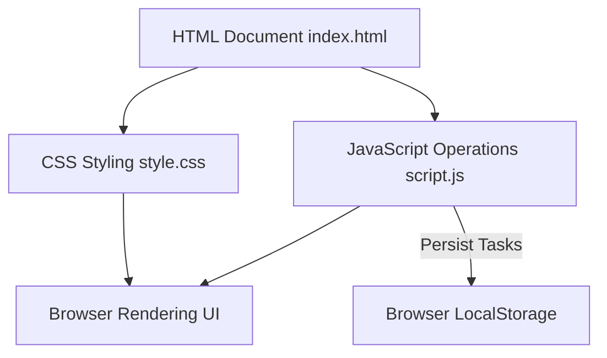

# To Do List

[](https://developer.mozilla.org/en-US/docs/Web/HTML)
[](https://developer.mozilla.org/en-US/docs/Web/JavaScript)
[](https://developer.mozilla.org/en-US/docs/Web/CSS)

## Table of Contents

- [Context](#-context)
- [Software features](#-software-features)
- [Technologies and tools](#-technologies-and-tools)
- [Architecture](#-architecture)
- [Repository structure](#-repository-structure)
- [Requirements](#-requirements)
- [How to run](#-how-to-run)
- [Author](#-author)

# 📌 Context 

This is a simple static front-end To-Do List application. It allows users to manage their daily tasks directly inside a web browser, automatically saving and loading the items using the browser's persistent cache (`localStorage`) so that data is not lost on page reload.

## 🚀 Software features

- **Create Tasks:** Quickly add new tasks to the list.
- **Toggle Status:** Mark tasks as completed or pending.
- **Delete Tasks:** Remove unwanted tasks from the list.
- **Data Persistence:** Automatically saves and retrieves the task list using `localStorage`.

## 🛠️ Technologies and tools

- HTML5 (Semantic elements)
- CSS3 (Visual styling)
- JavaScript (ES6+ for list actions and DOM manipulation)

## 📋 Architecture



## 📂 Repository structure

```text
- 📂 web-to-do-list/
  - 📄 index.html (Main webpage structure)
  - 📄 style.css (Visual layout and styling)
  - 📄 script.js (Task list logic and storage management)
  - 📄 LICENSE (MIT license file)
```

## 📦 Requirements

- A modern web browser (Google Chrome, Firefox, Safari, Edge, etc.)
- A text editor (like VS Code) for reviewing code

## ⚙️ How to run

### 1. Clone the Repository
Clone the repository to your local machine:
```bash
git clone https://github.com/MatheusRodri/web-to-do-list.git
cd web-to-do-list
```

### 2. Run the Application
Since this project consists of static files, no server or dependencies are needed to run:
- **Direct Open:** Navigate to the project folder using your operating system's file explorer and double-click the `index.html` file to open it in your default web browser.
- **VS Code Live Server (Alternative):** Open the project in VS Code, right-click `index.html`, and select **Open with Live Server** to view the app on a local live-reload server.

## 👤 Author

Matheus Rodrigues 
[LinkedIn](https://linkedin.com/in/matheus-rodrigues-mrj) [GitHub](https://github.com/MatheusRodri)